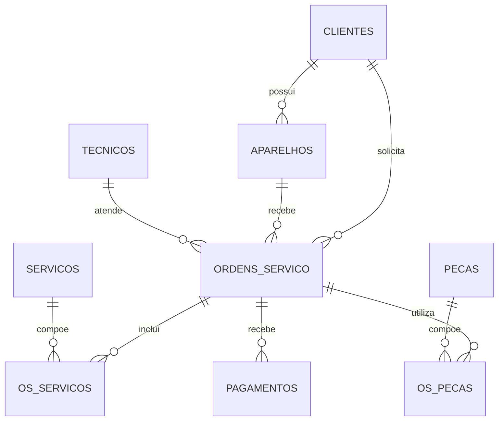

# TM Assistência SQL

Projeto de banco de dados relacional para a gestão de uma assistência técnica de celulares. A solução registra clientes, aparelhos, ordens de serviço, técnicos, serviços, peças e pagamentos, além de produzir indicadores úteis para a tomada de decisão.

> Projeto de portfólio desenvolvido por **Taynara Sousa**, unindo experiência real no setor de assistência técnica ao estudo de SQL e análise de dados.

## Problema de negócio

Uma assistência técnica precisa acompanhar cada aparelho desde a entrada até a entrega, controlar peças e pagamentos e transformar os registros operacionais em informações como faturamento, ticket médio, serviços mais procurados e ordens atrasadas.

## O que o projeto demonstra

- Modelagem relacional e normalização de dados
- Chaves primárias, estrangeiras, índices e restrições
- Relacionamentos N:N por tabelas associativas
- `JOIN`, agregações, subconsultas, CTEs e funções de janela
- Views para relatórios gerenciais
- Transações para operações críticas
- Consultas orientadas a problemas reais de negócio

## Tecnologias

- MySQL 8.0+
- MySQL Workbench (recomendado para execução e visualização)
- Git e GitHub

## Modelo de dados



## Estrutura

```text
tm-assistencia-sql/
├── sql/
│   ├── 01_schema.sql        # Banco, tabelas, restrições e índices
│   ├── 02_seed.sql          # Dados fictícios para demonstração
│   ├── 03_queries.sql       # Consultas de negócio comentadas
│   ├── 04_views.sql         # Views para indicadores gerenciais
│   └── 05_transaction.sql   # Exemplo seguro de baixa de peça
├── docs/
│   └── dicionario-dados.md  # Explicação das tabelas e campos
├── .gitignore
└── README.md
```

## Como executar

1. Abra o MySQL Workbench e conecte-se a um servidor MySQL 8.0+.
2. Execute os arquivos nesta ordem:

```sql
SOURCE sql/01_schema.sql;
SOURCE sql/02_seed.sql;
SOURCE sql/04_views.sql;
SOURCE sql/03_queries.sql;
```

No Workbench, também é possível abrir cada arquivo e clicar no ícone de raio.

## Indicadores disponíveis

- Faturamento mensal e acumulado
- Ticket médio dos serviços concluídos
- Serviços mais realizados
- Marcas e modelos mais atendidos
- Ordens abertas ou atrasadas
- Produtividade por técnico
- Clientes recorrentes
- Peças abaixo do estoque mínimo
- Tempo médio de conclusão

## Aprendizados

Este projeto mostra como transformar uma necessidade cotidiana em um banco de dados estruturado. As consultas foram pensadas para responder perguntas que uma gestora realmente faria, indo além do simples cadastro de informações.

## Próximas evoluções

- Criar dashboard no Power BI
- Construir uma API para cadastro e consulta das ordens
- Adicionar autenticação e níveis de acesso
- Automatizar testes do banco com GitHub Actions

## Autora

**Taynara Sousa** — Sócia-fundadora e diretora executiva da TM Celulares, em transição para a área de tecnologia.

